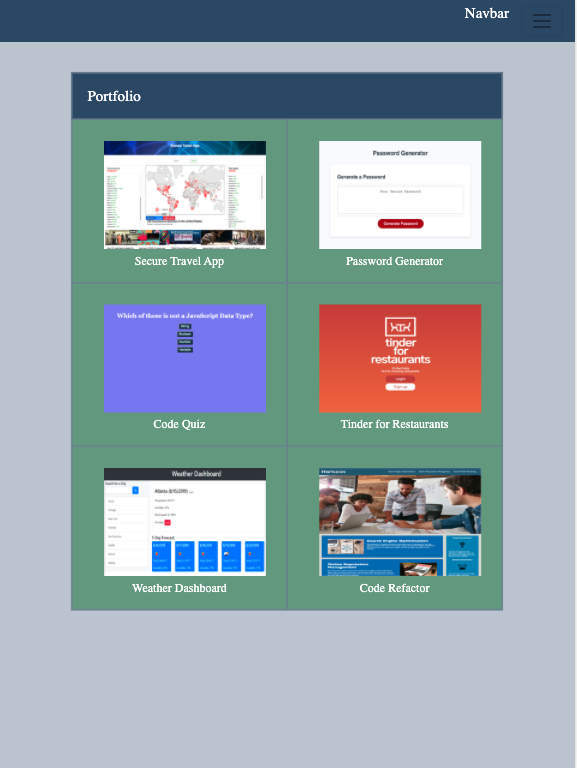
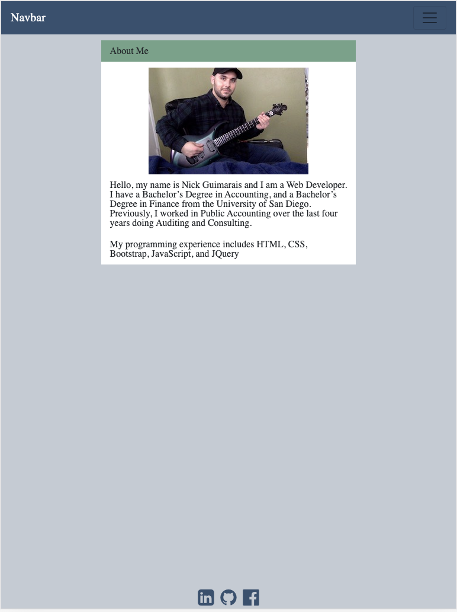
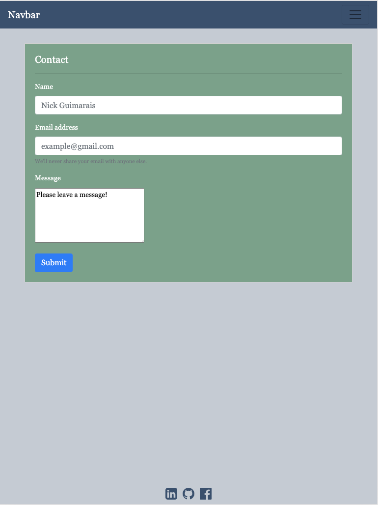

# Responsiveness Portfolio

My Responsiveness Portfolio contains three pages, an about me page, a contact page, and the portfolio page. The portfolio is responsive to all medium and small sized devices. 

## Overview

The Portfolio page contains my homework assignments and my first project so far called the Secure Travel App. 

The About Me page contains background information about me as well as my programming experience. 

The contact page includes a form where someone can leave me a message, as well as social media buttons that link to my Linked-in, my Github, and my Facebook account. 

The reponsiveness portfolio was created using HTML, CSS, and Bootstrap. The portfolio responsiveness was developed with Bootstrap and the use of media queries. 

## Images

## Links

 https://github.com/nickgusd/Homework-2-Repo

 https://nickgusd.github.io/Homework-2-Repo/

## Note

The page contains a navbar which will allow the user to navigate to each of the pages.

The Weather Dashboard link is a deadlink, as that assignment is still in progress. 