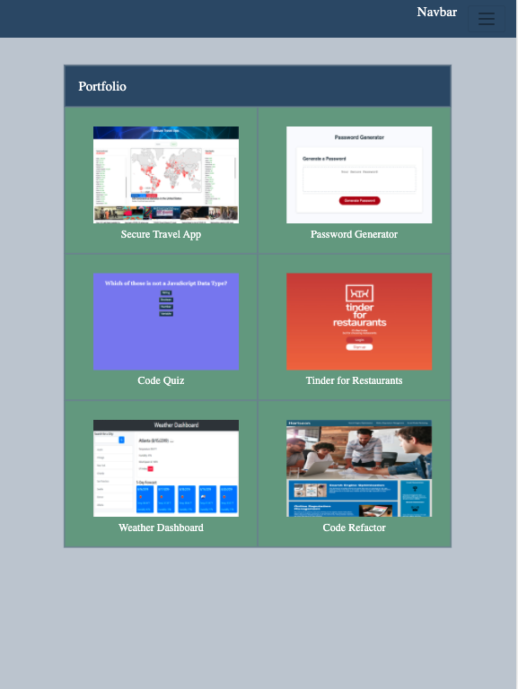
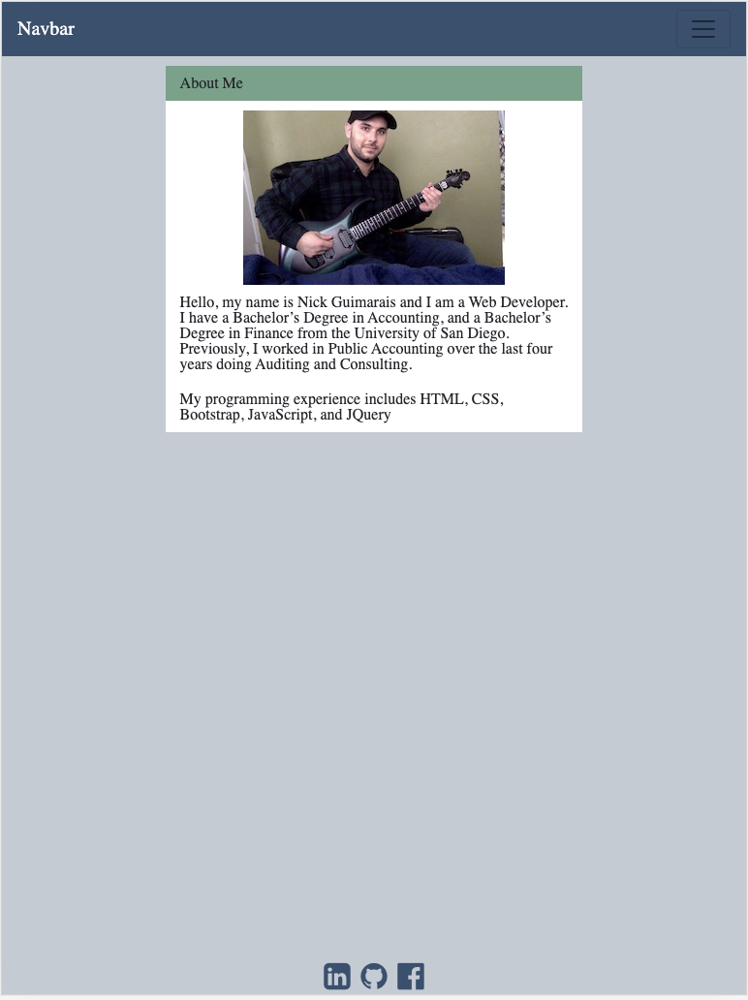
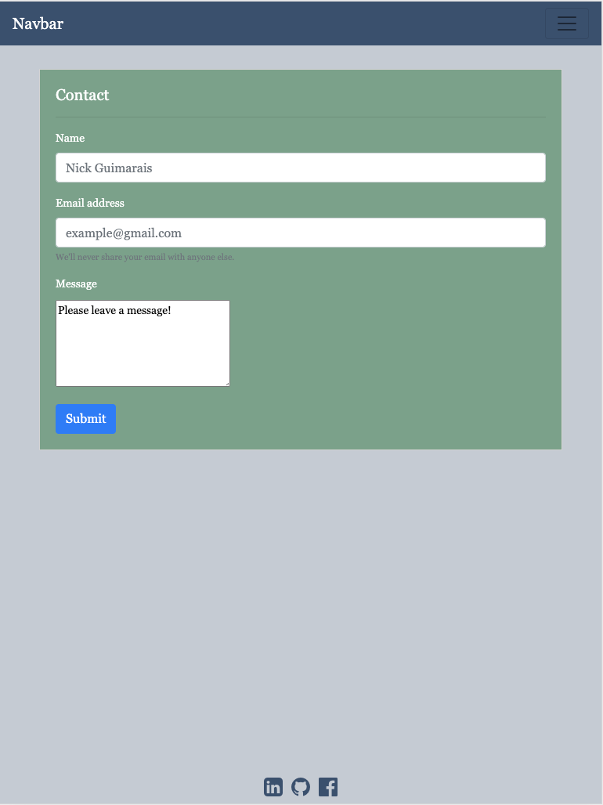

# React-Portfolio

My React Portfolio contains three pages, an about me page, a contact page, and the portfolio page. The portfolio is responsive to all medium and small sized devices. 

## Overview

The Portfolio page contains my favorite homework assignments and my three class projects.

The About Me page contains background information about me as well as my programming experience. 

The contact page includes a form where someone can leave me a message, as well as social media buttons that link to my Linked-in, my Github, and my Facebook account. 

The React portfolio was created using React.js and React Bootstrap. The portfolio responsiveness was developed with React Bootstrap and the use of media queries. 

## Images

## Links

 Deployed Application: https://nickgusd.github.io/React-Portfolio/

 

## Note

The page contains a navbar which will allow the user to navigate to each of the pages.

